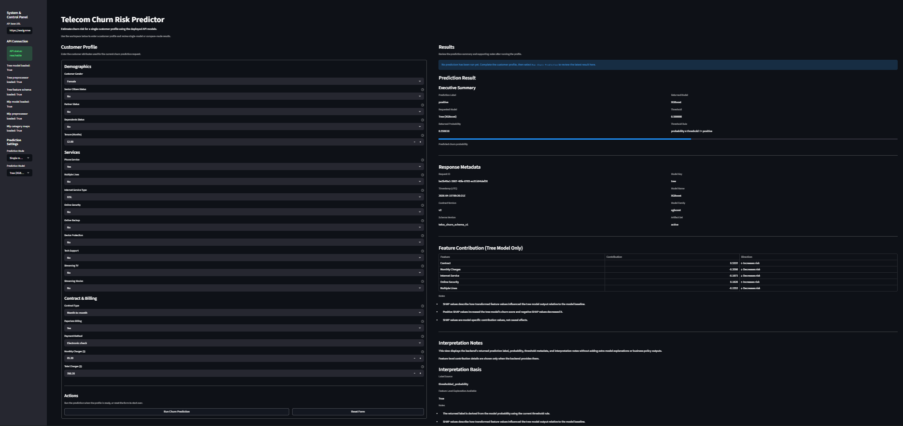
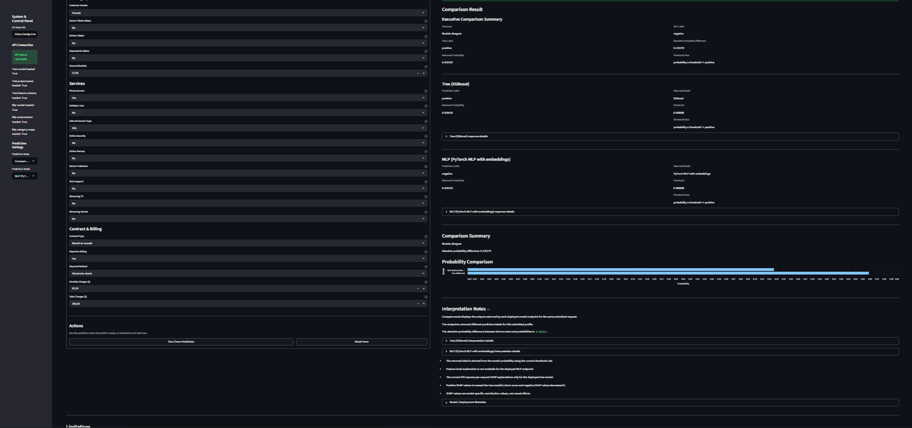
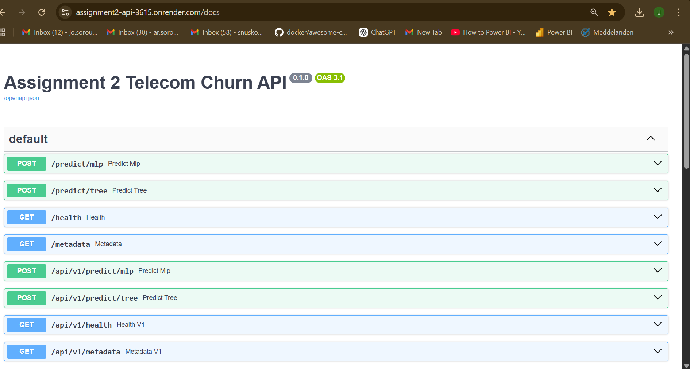
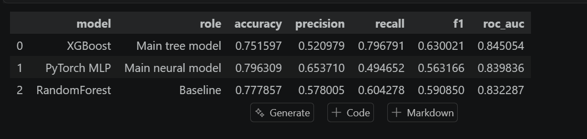
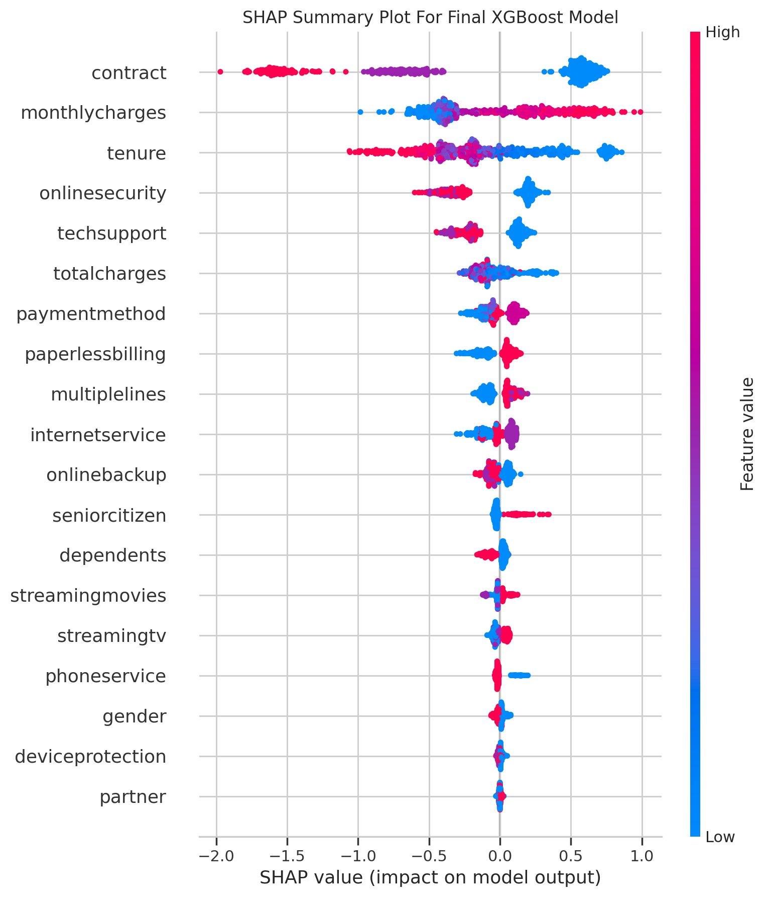
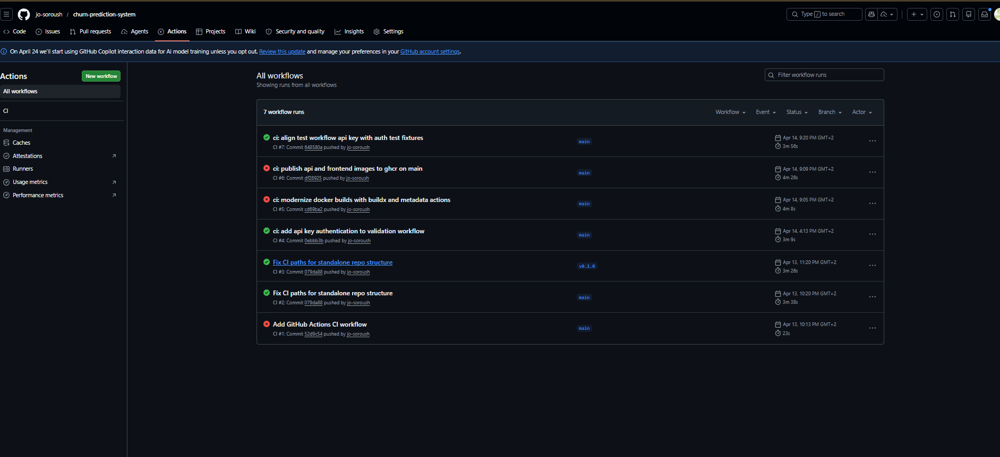

# Telecom Customer Churn Risk Predictor

## A Production-Style AI Decision-Support System for Customer Retention

---

## Overview

**Telecom Customer Churn Risk Predictor** is a deployable AI-powered decision-support system designed to estimate the likelihood of customer churn in a telecom context.

The system transforms structured customer data into actionable churn-risk insight through a fully integrated workflow that includes:

- tabular machine learning models
- a backend inference API
- a user-facing review interface
- model explainability support
- monitoring and validation infrastructure
- CI/CD-backed container delivery
- live cloud deployment

This project goes beyond a typical machine learning notebook and demonstrates how a churn prediction workflow can be packaged into a **usable, observable, and deployable AI product prototype**.

---

## Live Deployment

- **Frontend:**  
  `https://assignment2-frontend-yugh.onrender.com`

- **Backend Health Endpoint:**  
  `https://assignment2-api-3615.onrender.com/health`

- **API Documentation:**  
  `https://assignment2-api-3615.onrender.com/docs`

---

## Demo Screenshots

### Tree Model Prediction Result

### Compare Mode Result

### API Documentation

### Final Model Metrics Table

### SHAP Summary Plot

### GitHub Actions Workflow History

---

## Business Problem

Customer churn is costly, but retention teams usually have limited time and budget. In practice, the important business question is not only:

> “Will this customer churn?”

It is also:

> “Which customer profiles should be reviewed first, and how should risk be communicated clearly and responsibly?”

This system addresses that problem by providing a deployable churn-risk workflow that lets a reviewer:

- enter a single customer profile
- score that profile with either deployed model
- compare both deployed models on the same input
- review a bounded probability-based summary
- inspect tree-model feature contribution details
- use the result as support for manual follow-up

---

## Key Features

### Prediction System
- Binary churn classification
- Probability-based output
- Threshold-based label generation
- Shared schema across deployed models

### Dual Model Architecture
- **XGBoost**
  - primary deployed tree-based model
  - supports runtime explainability
- **PyTorch MLP with embeddings**
  - deployed neural model
  - supports mixed categorical and numerical input
- **RandomForest baseline**
  - retained as an evaluation artifact
  - not exposed as a deployed endpoint

### Explainability
- SHAP-based feature contribution for the tree model
- Top feature drivers returned per prediction
- Clear distinction between explainable and non-explainable deployed paths

### API Design
- FastAPI backend
- Versioned and unversioned endpoints
- Structured response contract
- Metadata, health, and metrics endpoints

### Security
- API key authentication using `X-API-Key`
- Protected prediction, metadata, and metrics routes
- Public health endpoints

### User Interface
- Streamlit-based frontend
- Single-model and compare-mode workflows
- Structured customer profile form
- Model metadata and interpretation display
- Tree feature contribution display

### Monitoring and Validation
- Prometheus metrics endpoint
- Grafana dashboard assets
- Request, latency, and error tracking
- Load testing with Locust
- Automated pytest coverage
- Artifact integrity validation

### Deployment and Delivery
- Dockerized services
- Docker Compose local orchestration
- GitHub Actions CI pipeline
- GHCR image publishing
- Render cloud deployment

---

## System Architecture

    User (Streamlit UI)
            ↓
    Frontend (Streamlit App)
            ↓
    Backend API (FastAPI)
            ↓
    Model Layer (XGBoost / MLP)
            ↓
    Artifacts (preprocessors, schema, metadata)

Additional layers:

- Monitoring: Prometheus + Grafana
- Validation: pytest + Locust + artifact checks
- Delivery: GitHub Actions + GHCR + Render

---

## Model Performance Summary

The notebook workflow compares three models:

- **XGBoost** as the main tree-based model
- **PyTorch MLP with embeddings** as the main neural model
- **RandomForest** as the baseline

Based on the saved notebook outputs and exported artifacts:

- XGBoost achieved the strongest overall product-facing performance
- the MLP remained competitive as a second deployed inference path
- RandomForest was retained as a comparison baseline
- SHAP analysis highlighted features such as contract, tenure, monthly charges, and online security as meaningful churn-related drivers

---

## Example API Request

    curl -X POST "https://assignment2-api-3615.onrender.com/predict/tree" \
      -H "Content-Type: application/json" \
      -H "X-API-Key: YOUR_API_KEY" \
      -d '{
        "gender": "Female",
        "seniorcitizen": 0,
        "partner": "Yes",
        "dependents": "No",
        "tenure": 12,
        "phoneservice": "Yes",
        "multiplelines": "No",
        "internetservice": "DSL",
        "onlinesecurity": "No",
        "onlinebackup": "Yes",
        "deviceprotection": "No",
        "techsupport": "No",
        "streamingtv": "No",
        "streamingmovies": "No",
        "contract": "Month-to-month",
        "paperlessbilling": "Yes",
        "paymentmethod": "Electronic check",
        "monthlycharges": 70.35,
        "totalcharges": 845.5
      }'

---

## Example API Response

    {
      "request": {
        "request_id": "bc52457d-43ae-405f-b4ab-98a487c37cdb",
        "timestamp_utc": "2026-04-15T10:48:40Z"
      },
      "contract": {
        "contract_version": "v2",
        "schema_version": "telco_churn_schema_v1"
      },
      "model": {
        "model_key": "tree",
        "model_name": "XGBoost",
        "model_family": "xgboost",
        "artifact_set": "active"
      },
      "prediction_result": {
        "label": "positive",
        "probability": 0.508867,
        "threshold": 0.5,
        "threshold_rule": "probability >= threshold => positive"
      },
      "interpretation_basis": {
        "label_source": "thresholded_probability",
        "feature_level_explanation_available": true
      },
      "explanation": {
        "available": true,
        "method": "shap_tree",
        "top_features": [
          {
            "feature": "contract",
            "direction": "increases_churn_score"
          },
          {
            "feature": "monthlycharges",
            "direction": "decreases_churn_score"
          },
          {
            "feature": "internetservice",
            "direction": "decreases_churn_score"
          }
        ]
      }
    }

---

## Repository Structure

    .
    ├── README.md
    ├── tabular.ipynb
    ├── classifier_deploy/
    │   ├── app/
    │   ├── artifacts/
    │   ├── artifact_versions/
    │   ├── docker/
    │   ├── frontend/
    │   ├── tests/
    │   ├── docker-compose.yml
    │   └── README.md
    ├── project_docs/
    │   └── screenshots/
    └── notes/

---

## Technical Documentation

Detailed deployment and implementation documentation is available in:

`classifier_deploy/README.md`

That README covers:

- backend and frontend implementation details
- endpoints
- environment variables
- Docker usage
- monitoring
- testing
- deployment-oriented workflow details

---

## Running Locally

### 1. Clone Repository

    git clone https://github.com/jo-soroush/churn-prediction-system.git
    cd churn-prediction-system/classifier_deploy

### 2. Configure Environment Variables

    API_KEY=your_key
    FRONTEND_API_KEY=your_key

### 3. Run with Docker Compose

    docker compose up --build

### 4. Access Services

- Frontend: `http://localhost:8501`
- API: `http://localhost:8000`
- API docs: `http://localhost:8000/docs`

---

## Tech Stack

- **Backend:** FastAPI
- **Frontend:** Streamlit
- **Models:** XGBoost, PyTorch, RandomForest
- **Explainability:** SHAP
- **Data Science:** pandas, scikit-learn, matplotlib, seaborn
- **Monitoring:** Prometheus, Grafana
- **Testing:** pytest, Locust
- **Containers:** Docker, Docker Compose
- **CI/CD:** GitHub Actions
- **Registry:** GHCR
- **Deployment:** Render

---

## Limitations

- No database persistence layer
- No CRM or external system integration
- No user login or role system
- No batch prediction workflow
- No automated retraining pipeline
- No feature-level explanation for the deployed MLP model
- Some deployment settings and secrets are managed externally
- The system is a serious prototype, not a full enterprise retention platform

---

## Why This Project Matters

Many machine learning projects stop at the notebook stage. This project goes further by showing how a tabular churn workflow can become a **real AI product prototype** with:

- deployable model serving
- structured API design
- explainability
- monitoring
- UI-based interaction
- testing
- CI/CD
- cloud-hosted delivery

It is designed as a **portfolio-grade system** that bridges machine learning and real-world product engineering.

---

## Final Note

This repository contains both the **product-facing project view** and the **deployment-focused technical implementation**.

- The root `README.md` presents the project at a portfolio and system level
- `classifier_deploy/README.md` provides the technical implementation and deployment details

Together, they show how a machine learning solution can evolve from modeling work into a structured, observable, and deployable AI system.