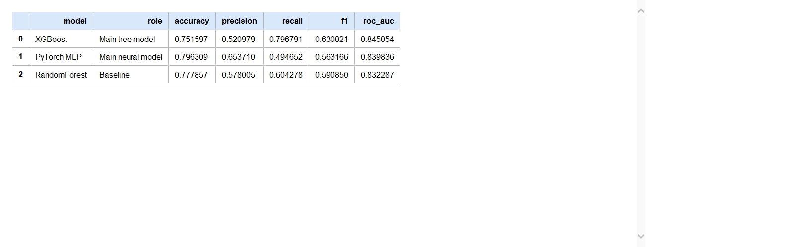

# Customer Churn Risk Prediction System

Professional rebuild of Assignment 2 for tabular machine learning deployment. This project packages a telecom churn workflow as a decision-support system with:

- a FastAPI prediction API
- a Streamlit frontend for guided review
- two deployed models behind a shared input contract
- saved inference artifacts and automated API tests
- local and Docker-based run paths

The current frontend is positioned as a retention decision-support console, not as an autonomous retention platform. It predicts churn risk for a single customer profile, summarizes the result, adds bounded interpretation notes, and shows suggested action guidance derived from the frontend’s current presentation rules.

## Business Problem

Customer churn is costly, but retention teams usually have limited time and budget. The practical business question is not just "will this customer churn?" but "which customer profiles should be reviewed first, and how should risk be communicated responsibly?"

This project addresses that problem with a deployable churn-risk workflow that lets a reviewer:

- enter one customer profile
- score that profile with either deployed model
- compare both deployed models on the same input
- review a compact risk summary and probability output
- see a clearly bounded action cue for manual follow-up

## Solution Summary

The repository combines notebook-based model development with a lightweight deployment stack:

- `tabular.ipynb` contains the Assignment 2 modeling workflow
- FastAPI serves prediction endpoints for XGBoost and a PyTorch MLP with embeddings
- Streamlit provides a business-facing interface for single-model review or model comparison
- exported artifacts in `artifacts/` keep inference reproducible
- tests validate health, schema consistency, valid predictions, invalid payload handling, and artifact presence

## Key Features

- Shared prediction schema for both deployed models
- Two model endpoints:
  - `POST /predict/tree`
  - `POST /predict/mlp`
- Health endpoints:
  - `GET /health`
  - `GET /api/v1/health`
- Streamlit UI with:
  - system and control panel
  - customer profile workspace
  - grouped actions
  - empty, loading, success, and error states
  - prediction summary
  - interpretation notes
  - suggested action guidance
- Docker Compose workflow for local multi-container startup
- Verified sample request payload in `artifacts/sample_input.json`

## Repository Structure

```text
assignments/assignment_2/
├── tabular.ipynb
├── classifier_deploy/
│   ├── app/
│   │   ├── config.py
│   │   ├── logging_config.py
│   │   ├── main.py
│   │   ├── models.py
│   │   ├── predict.py
│   │   └── schemas.py
│   ├── artifacts/
│   │   ├── category_maps.json
│   │   ├── feature_schema.json
│   │   ├── mlp_model.pt
│   │   ├── mlp_preprocessor.pkl
│   │   ├── model_metadata.json
│   │   ├── random_forest.pkl
│   │   ├── sample_input.json
│   │   ├── tree_preprocessor.pkl
│   │   └── xgb_model.json
│   ├── artifact_versions/
│   │   ├── assignment_baseline/
│   │   └── professional_latest/
│   ├── docker/
│   │   ├── Dockerfile.api
│   │   └── Dockerfile.frontend
│   ├── frontend/
│   │   └── app.py
│   ├── tests/
│   │   ├── conftest.py
│   │   ├── test_artifacts.py
│   │   ├── test_health.py
│   │   ├── test_invalid_payloads.py
│   │   ├── test_predict_mlp.py
│   │   ├── test_predict_tree.py
│   │   └── test_schema_consistency.py
│   ├── docker-compose.yml
│   ├── pytest.ini
│   ├── requirements-api.txt
│   ├── requirements-frontend.txt
│   └── README.md
└── project_docs/
    └── screenshots/
        ├── comparison_table.png
        ├── frontend_home.png
        ├── health_endpoint.png
        └── shap_summary.png
```

## Models Used

### Random Forest

Included as a baseline artifact from the notebook workflow. It is present in `artifacts/random_forest.pkl` but is not exposed as a deployed API endpoint.

### XGBoost

This is the deployed tree-based model behind:

```text
POST /predict/tree
```

It loads from `artifacts/xgb_model.json` and uses `artifacts/tree_preprocessor.pkl`.

### PyTorch MLP with Embeddings

This is the deployed neural model behind:

```text
POST /predict/mlp
```

It loads from:

- `artifacts/mlp_model.pt`
- `artifacts/mlp_preprocessor.pkl`
- `artifacts/category_maps.json`

## Data and Notebook Summary

The notebook for Assignment 2 is:

```text
assignments/assignment_2/tabular.ipynb
```

Based on the repository contents and saved artifacts, the notebook supports the end-to-end tabular workflow for telecom churn modeling, including preprocessing, model training, evaluation, artifact export, and explainability visuals saved in `project_docs/screenshots/`.

Verified supporting evidence in the repo includes:

- exported model artifacts for XGBoost and MLP
- a Random Forest baseline artifact
- `model_metadata.json`
- screenshot files for a comparison table and SHAP summary plot

## Frontend Overview

The Streamlit frontend lives at:

```text
frontend/app.py
```

It currently supports:

- API connectivity status in the sidebar
- model mode selection:
  - single model
  - compare both models
- structured customer input sections
- grouped actions for run and reset
- clear result states before and after submission
- executive-style prediction summaries
- interpretation notes that stay within the deployed API’s real capabilities
- suggested action guidance that is explicitly frontend-derived and policy-bounded

The frontend does not claim feature-level explainability. It explicitly states that feature-level drivers are not available in the current deployed API.

## API Overview

The FastAPI entry point is:

```text
app/main.py
```

### Health Endpoints

Verified in code and tests:

```text
GET /health
GET /api/v1/health
```

The health response reports whether the active tree and MLP inference resources were loaded successfully.

Example shape:

```json
{
  "status": "ok",
  "tree_model_loaded": true,
  "tree_preprocessor_loaded": true,
  "tree_feature_schema_loaded": true,
  "mlp_model_loaded": true,
  "mlp_preprocessor_loaded": true,
  "mlp_category_maps_loaded": true
}
```

### Prediction Endpoints

Verified in `app/predict.py`:

```text
POST /predict/tree
POST /predict/mlp
```

Both endpoints use the same Pydantic request model and return:

```json
{
  "model_name": "XGBoost",
  "prediction": "negative",
  "probability": 0.396167
}
```

or

```json
{
  "model_name": "PyTorch MLP with embeddings",
  "prediction": "negative",
  "probability": 0.389165
}
```

### Error Handling

The API includes structured error responses in `app/main.py` and `app/schemas.py`. Invalid payload tests verify a response shape like:

```json
{
  "error": {
    "type": "validation_error",
    "message": "Request validation failed",
    "details": []
  }
}
```

## Example Input

Verified from `artifacts/sample_input.json`:

```json
{
  "gender": "Female",
  "seniorcitizen": 0,
  "partner": "Yes",
  "dependents": "No",
  "tenure": 24,
  "phoneservice": "Yes",
  "multiplelines": "No",
  "internetservice": "Fiber optic",
  "onlinesecurity": "No",
  "onlinebackup": "Yes",
  "deviceprotection": "Yes",
  "techsupport": "No",
  "streamingtv": "Yes",
  "streamingmovies": "No",
  "contract": "One year",
  "paperlessbilling": "Yes",
  "paymentmethod": "Bank transfer (automatic)",
  "monthlycharges": 79.9,
  "totalcharges": 1917.6
}
```

Current deployed schema evidence in `app/schemas.py` shows:

- `tenure` is numeric
- `monthlycharges` is numeric
- `totalcharges` is numeric

## How to Run Locally

Run these commands from:

```text
assignments/assignment_2/classifier_deploy
```

### 1. Create and activate a virtual environment

Windows PowerShell:

```powershell
python -m venv .venv
.venv\Scripts\Activate.ps1
```

### 2. Install API dependencies

```powershell
python -m pip install --upgrade pip
python -m pip install -r requirements-api.txt
```

### 3. Start the API

```powershell
python -m uvicorn app.main:app --host 0.0.0.0 --port 8000
```

To run the same app locally with multiple worker processes for a controlled serving comparison:

```powershell
python -m uvicorn app.main:app --host 0.0.0.0 --port 8000 --workers 2
```

### 4. Verify health

```powershell
curl http://localhost:8000/health
```

### 5. Install frontend dependencies

Use a separate shell if you want to run the frontend alongside the API.

```powershell
python -m pip install -r requirements-frontend.txt
```

### 6. Start the Streamlit frontend

From the same `classifier_deploy` directory:

```powershell
streamlit run frontend/app.py
```

Then open:

```text
http://localhost:8501
```

If you run the frontend outside Docker, the API base URL should be:

```text
http://localhost:8000
```

## Docker Instructions

Docker support is verified by:

- `docker-compose.yml`
- `docker/Dockerfile.api`
- `docker/Dockerfile.frontend`

From `assignments/assignment_2/classifier_deploy`:

```powershell
docker compose up --build
```

This starts:

- API on `http://localhost:8000`
- Streamlit frontend on `http://localhost:8501`

To stop the stack:

```powershell
docker compose down
```

### Experimental worker toggle

The Docker API service keeps the baseline single-worker mode by default through `API_WORKERS=1`.

For a controlled runtime comparison, start the same stack with two Uvicorn workers:

```powershell
$env:API_WORKERS = "2"
docker compose up --build
```

Reset to the baseline mode with:

```powershell
Remove-Item Env:API_WORKERS
docker compose up --build
```

Inside Docker Compose, the frontend uses:

```text
http://api:8000
```

as its default API base URL.

## Example API Requests

### Tree Model

```powershell
curl -X POST http://localhost:8000/predict/tree `
  -H "Content-Type: application/json" `
  -d "{\"gender\":\"Female\",\"seniorcitizen\":0,\"partner\":\"Yes\",\"dependents\":\"No\",\"tenure\":24,\"phoneservice\":\"Yes\",\"multiplelines\":\"No\",\"internetservice\":\"Fiber optic\",\"onlinesecurity\":\"No\",\"onlinebackup\":\"Yes\",\"deviceprotection\":\"Yes\",\"techsupport\":\"No\",\"streamingtv\":\"Yes\",\"streamingmovies\":\"No\",\"contract\":\"One year\",\"paperlessbilling\":\"Yes\",\"paymentmethod\":\"Bank transfer (automatic)\",\"monthlycharges\":79.9,\"totalcharges\":1917.6}"
```

### MLP Model

```powershell
curl -X POST http://localhost:8000/predict/mlp `
  -H "Content-Type: application/json" `
  -d "{\"gender\":\"Female\",\"seniorcitizen\":0,\"partner\":\"Yes\",\"dependents\":\"No\",\"tenure\":24,\"phoneservice\":\"Yes\",\"multiplelines\":\"No\",\"internetservice\":\"Fiber optic\",\"onlinesecurity\":\"No\",\"onlinebackup\":\"Yes\",\"deviceprotection\":\"Yes\",\"techsupport\":\"No\",\"streamingtv\":\"Yes\",\"streamingmovies\":\"No\",\"contract\":\"One year\",\"paperlessbilling\":\"Yes\",\"paymentmethod\":\"Bank transfer (automatic)\",\"monthlycharges\":79.9,\"totalcharges\":1917.6}"
```

## Screenshots

Verified screenshot assets exist in `../project_docs/screenshots/`.

### Frontend


### Health Endpoint


### Evaluation Artifacts




## Test Coverage

The deployment folder includes automated tests for:

- health endpoint shape and readiness fields
- tree prediction response shape
- MLP prediction response shape
- invalid payload handling
- artifact presence
- schema consistency

From `assignments/assignment_2/classifier_deploy`:

```powershell
pytest
```

## Limitations and Responsible Use

This project is suitable as a portfolio-grade ML deployment demo and assignment submission. It is not verified as a production retention platform.

Important limitations supported by the current codebase:

- The frontend is a prototype decision-support interface, not a live CRM tool.
- There is no verified customer-history view, export workflow, or outreach tracking flow.
- Suggested actions are frontend-derived presentation aids, not an autonomous recommendation engine.
- Feature-level explanation is not available from the deployed API, and the frontend states that explicitly.
- Prediction labels are neutral `positive` and `negative` because the exported deployment artifacts do not provide a human-readable label map.
- The API uses a threshold rule of `probability >= 0.5` for `positive`, implemented in `app/predict.py`.
- A database URL exists in configuration, but the current Docker Compose file only starts API and frontend services, and the present UI/API flow does not expose persistence features.

## Assignment Alignment

This project aligns with the Assignment 2 brief through a combination of notebook work and deployable artifacts:

- tabular classification problem
- mixed categorical and numerical inputs
- multiple model families for comparison
- saved artifacts for inference
- deployed prediction API
- business-facing frontend for demonstration
- evaluation and explainability evidence retained in notebook outputs and screenshots

## Future Improvements

Reasonable next steps, based on the current implementation, would be:

- add a human-readable class label map if artifact exports support it
- add model version display in the frontend
- expose richer API metadata for auditability
- add authenticated usage flows if the project moves beyond demo scope
- add true explanation endpoints only if the backend is extended to support them safely

## Project Context

This README documents the Assignment 2 deployment project under:

```text
assignments/assignment_2/classifier_deploy
```

It is intended to support:

- GitHub review
- technical interview walkthroughs
- portfolio presentation
- assignment submission clarity
