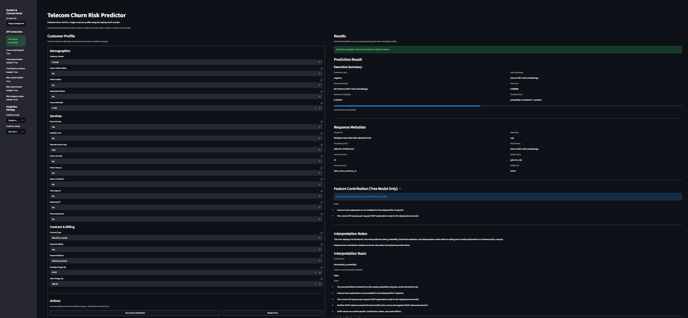
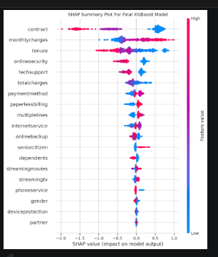

# Telecom Customer Churn Risk Predictor

Production-minded AI decision-support prototype for telecom churn assessment, combining tabular machine learning, deployable inference, explainability, validation, monitoring, and a user-facing review interface.

---

## Overview

**Telecom Customer Churn Risk Predictor** packages a telecom churn workflow as a deployable AI product prototype rather than a notebook-only experiment.

The system supports:

- two deployed prediction models behind a shared input contract
- structured prediction responses with model and contract metadata
- tree-based feature-level explanation using SHAP-derived contributions
- a Streamlit frontend for guided single-customer review and model comparison
- a FastAPI backend with health, prediction, metadata, and metrics surfaces
- saved artifacts for reproducible inference
- tests, monitoring, Docker runtime, CI/CD, and cloud deployment evidence

This project should be understood as a **production-minded decision-support system**, not as a full enterprise retention platform and not as a simple classroom demo.

---

## Live Deployment

### Frontend
`https://assignment2-frontend-yugh.onrender.com`

### Backend API Health
`https://assignment2-api-3615.onrender.com/health`

### API Documentation
`https://assignment2-api-3615.onrender.com/docs`

---

## Business Context

Customer churn is expensive, but retention teams often have limited time, budget, and review capacity. In practice, the business question is rarely just:

> “Will this customer churn?”

The more useful question is:

> “Which customer profiles should be reviewed first, and how can risk be communicated clearly and responsibly?”

This project addresses that problem by turning structured telecom customer data into a deployable churn-risk workflow that helps a reviewer:

- enter one customer profile
- score that profile through either deployed model
- compare both deployed models on the same input
- review a bounded risk summary and probability output
- inspect explanation details for the tree-based model
- use the result as support for manual follow-up rather than autonomous action

---

## Product Summary

The repository combines notebook-based model development with a lightweight but serious deployment stack:

- `tabular.ipynb` contains the end-to-end modeling workflow
- FastAPI serves prediction endpoints for **XGBoost** and a **PyTorch MLP with embeddings**
- Streamlit provides a business-facing interface for single-model review or model comparison
- exported artifacts in `artifacts/` keep inference reproducible
- tests validate health, schema consistency, valid predictions, invalid payload handling, artifact presence, artifact integrity, and authentication
- Docker, Prometheus, Grafana, CI, GHCR, and Render deployment support the operational story

---

## Key Features

### Prediction Workflow
- Binary churn prediction
- Probability-based output
- Shared schema for both deployed models
- Single-customer scoring flow
- Compare-both-models mode in the frontend

### Deployed Models
- **XGBoost**
  - primary tree-based deployed path
  - supports runtime feature contribution output
- **PyTorch MLP with embeddings**
  - deployed neural path
  - handles mixed categorical and numeric inputs
- **RandomForest baseline**
  - retained as an evaluation artifact
  - not exposed as a deployed endpoint

### Explainability
- SHAP-based feature contribution support for the tree model
- top contributing features returned per request
- explicit statement that MLP feature-level explanation is currently unavailable

### API Design
- FastAPI backend
- versioned and unversioned routes
- structured response contract
- health endpoints
- metadata endpoints
- metrics endpoint

### Security
- API key authentication via `X-API-Key`
- protected prediction, metadata, and metrics routes
- public health endpoints

### User Interface
- system and control panel
- API connectivity visibility
- customer profile workspace
- single-model prediction mode
- compare-mode prediction flow
- result summary
- metadata display
- interpretation notes
- tree feature contribution section

### Monitoring and Validation
- Prometheus metrics
- Grafana dashboard assets
- Locust performance testing
- pytest automation
- artifact integrity validation

### Deployment and Delivery
- Dockerized API and frontend
- Docker Compose for local multi-service orchestration
- GitHub Actions CI
- GHCR image publishing
- Render deployment evidence for backend and frontend

---

## Screenshots

### Tree Model Result

### MLP Model Result

### Compare Mode

### API Documentation

### Final Model Metrics Table

### SHAP Summary Plot

### GitHub Actions Workflow History

---

## Repository Structure

    classifier_deploy/
    ├── app/
    │   ├── auth.py
    │   ├── config.py
    │   ├── logging_config.py
    │   ├── main.py
    │   ├── metrics.py
    │   ├── models.py
    │   ├── predict.py
    │   └── schemas.py
    ├── artifacts/
    │   ├── category_maps.json
    │   ├── feature_schema.json
    │   ├── mlp_model.pt
    │   ├── mlp_preprocessor.pkl
    │   ├── model_metadata.json
    │   ├── random_forest.pkl
    │   ├── sample_input.json
    │   ├── tree_preprocessor.pkl
    │   └── xgb_model.json
    ├── artifact_versions/
    │   ├── assignment_baseline/
    │   └── professional_latest/
    ├── docker/
    │   ├── Dockerfile.api
    │   ├── Dockerfile.frontend
    │   ├── entrypoint.api.sh
    │   ├── prometheus.yml
    │   ├── prometheus-alerts.yml
    │   └── grafana/
    ├── frontend/
    │   └── app.py
    ├── project_docs/
    │   ├── monitoring/
    │   └── performance/
    ├── tests/
    │   ├── performance/
    │   ├── conftest.py
    │   ├── test_artifact_integrity.py
    │   ├── test_artifacts.py
    │   ├── test_auth.py
    │   ├── test_health.py
    │   ├── test_invalid_payloads.py
    │   ├── test_metadata.py
    │   ├── test_predict_mlp.py
    │   ├── test_predict_tree.py
    │   └── test_schema_consistency.py
    ├── .env.example
    ├── docker-compose.yml
    ├── pytest.ini
    ├── requirements-api.txt
    ├── requirements-frontend.txt
    ├── requirements-lock.txt
    └── README.md

---

## Models Used

### RandomForest Baseline
Included as a baseline artifact from the notebook workflow. It is present in:

    artifacts/random_forest.pkl

It is retained for comparison context but is **not** exposed as a deployed endpoint.

### XGBoost
This is the deployed tree-based model behind:

    POST /predict/tree
    POST /api/v1/predict/tree

It loads from:

- `artifacts/xgb_model.json`
- `artifacts/tree_preprocessor.pkl`

This is also the current model path that supports runtime feature contribution output.

### PyTorch MLP With Embeddings
This is the deployed neural model behind:

    POST /predict/mlp
    POST /api/v1/predict/mlp

It loads from:

- `artifacts/mlp_model.pt`
- `artifacts/mlp_preprocessor.pkl`
- `artifacts/category_maps.json`

The model supports deployable inference but does **not** currently expose feature-level explanation.

---

## Notebook and Modeling Workflow

The main notebook is:

    tabular.ipynb

The notebook implements a leakage-aware end-to-end workflow including:

- helper and runtime setup
- Kaggle-based dataset ingestion
- exploratory data analysis
- train/validation/test splitting
- preprocessing design
- RandomForest baseline
- XGBoost tuning with early stopping
- PyTorch MLP tuning
- validation-based model selection
- final test reporting
- feature importance
- SHAP summary plot
- artifact export
- artifact reload smoke test

### Modeling Discipline

The workflow follows a professional split strategy:

- training on the training split
- tuning and model selection on the validation split
- final selected-model reporting on the untouched test split

This keeps the workflow cleaner, more defensible, and less leakage-prone than a casual notebook pipeline.

### Key Notebook Findings

The notebook artifacts and visuals support several meaningful observations:

- the target is imbalanced in a realistic churn pattern
- contract, tenure, monthly charges, and online security are among the strongest churn-related signals
- XGBoost outperformed the baseline and the MLP in the final comparison
- the tree model was therefore a strong candidate for the product-facing explainable path

---

## Frontend Overview

The Streamlit frontend is located at:

    frontend/app.py

It supports:

- API connectivity status
- model readiness visibility
- prediction mode selection
  - single model
  - compare both models
- structured customer profile input sections
- grouped actions for run and reset
- result states before and after submission
- executive-style prediction summaries
- model and deployment metadata display
- interpretation notes
- tree feature contribution display when available

The frontend is intentionally positioned as a **retention decision-support console**, not as an autonomous retention engine.

---

## API Overview

The FastAPI entry point is:

    app/main.py

### Public Health Endpoints

    GET /health
    GET /api/v1/health

These endpoints report whether the active tree and MLP inference resources loaded successfully.

### Protected Endpoints

    POST /predict/tree
    POST /predict/mlp
    POST /api/v1/predict/tree
    POST /api/v1/predict/mlp
    GET /metadata
    GET /api/v1/metadata
    GET /metrics

Protected routes require:

    X-API-Key: <your_api_key>

### Structured Prediction Contract

The API returns structured responses that include:

- request metadata
- contract metadata
- model metadata
- prediction result
- interpretation basis
- explanation section

This makes the deployed API richer and more auditable than a flat `prediction + probability` demo response.

---

## Example Health Response

    {
      "status": "ok",
      "tree_model_loaded": true,
      "tree_preprocessor_loaded": true,
      "tree_feature_schema_loaded": true,
      "mlp_model_loaded": true,
      "mlp_preprocessor_loaded": true,
      "mlp_category_maps_loaded": true
    }

---

## Example Valid Input

Verified from the deployed schema and sample input pattern:

    {
      "gender": "Female",
      "seniorcitizen": 0,
      "partner": "Yes",
      "dependents": "No",
      "tenure": 12,
      "phoneservice": "Yes",
      "multiplelines": "No",
      "internetservice": "DSL",
      "onlinesecurity": "No",
      "onlinebackup": "Yes",
      "deviceprotection": "No",
      "techsupport": "No",
      "streamingtv": "No",
      "streamingmovies": "No",
      "contract": "Month-to-month",
      "paperlessbilling": "Yes",
      "paymentmethod": "Electronic check",
      "monthlycharges": 70.35,
      "totalcharges": 845.5
    }

The current deployed request schema uses lowercase field names aligned with the saved feature schema and API contract.

---

## Example Tree Prediction Response

A real successful deployed response included the following structure:

    {
      "request": {
        "request_id": "bc52457d-43ae-405f-b4ab-98a487c37cdb",
        "timestamp_utc": "2026-04-15T10:48:40Z"
      },
      "contract": {
        "contract_version": "v2",
        "schema_version": "telco_churn_schema_v1"
      },
      "model": {
        "model_key": "tree",
        "model_name": "XGBoost",
        "model_family": "xgboost",
        "artifact_set": "active"
      },
      "prediction_result": {
        "label": "positive",
        "probability": 0.508867,
        "threshold": 0.5,
        "threshold_rule": "probability >= threshold => positive"
      },
      "interpretation_basis": {
        "label_source": "thresholded_probability",
        "feature_level_explanation_available": true,
        "notes": [
          "The returned label is derived from the model probability using the current threshold rule.",
          "SHAP values describe how transformed feature values influenced the tree model output relative to the model baseline.",
          "Positive SHAP values increased the tree model's churn score and negative SHAP values decreased it.",
          "SHAP values are model-specific contribution values, not causal effects."
        ]
      },
      "explanation": {
        "available": true,
        "method": "shap_tree",
        "top_features": [
          {
            "feature": "contract",
            "display_name": "Contract",
            "shap_value": 0.535769,
            "direction": "increases_churn_score"
          },
          {
            "feature": "monthlycharges",
            "display_name": "Monthly Charges",
            "shap_value": -0.310759,
            "direction": "decreases_churn_score"
          },
          {
            "feature": "internetservice",
            "display_name": "Internet Service",
            "shap_value": -0.183278,
            "direction": "decreases_churn_score"
          },
          {
            "feature": "onlinesecurity",
            "display_name": "Online Security",
            "shap_value": 0.175897,
            "direction": "increases_churn_score"
          },
          {
            "feature": "multiplelines",
            "display_name": "Multiple Lines",
            "shap_value": -0.151556,
            "direction": "decreases_churn_score"
          }
        ],
        "notes": [
          "SHAP values describe how transformed feature values influenced the tree model output relative to the model baseline.",
          "Positive SHAP values increased the tree model's churn score and negative SHAP values decreased it.",
          "SHAP values are model-specific contribution values, not causal effects."
        ]
      }
    }

This response illustrates that the deployed API now provides:

- contract versioning
- schema version visibility
- model identity
- threshold rule transparency
- interpretation basis
- bounded tree-model explanation output

---

## Error Handling

The API includes structured error handling for:

- validation failures
- HTTP exceptions
- generic exceptions

Example validation error shape:

    {
      "error": {
        "type": "validation_error",
        "message": "Request validation failed",
        "details": []
      }
    }

This behavior is also reinforced through test coverage.

---

## Local Development

Run commands from:

    classifier_deploy

### 1. Create and activate a virtual environment

    python -m venv .venv
    source .venv/bin/activate

On Windows PowerShell:

    python -m venv .venv
    .venv\Scripts\Activate.ps1

### 2. Install API dependencies

    python -m pip install --upgrade pip
    python -m pip install -r requirements-api.txt

### 3. Start the API

    python -m uvicorn app.main:app --host 0.0.0.0 --port 8000

To compare serving behavior with multiple workers:

    python -m uvicorn app.main:app --host 0.0.0.0 --port 8000 --workers 2

### 4. Verify health

    curl http://localhost:8000/health

### 5. Install frontend dependencies

Use a separate shell if running frontend and API side by side.

    python -m pip install -r requirements-frontend.txt

### 6. Start the frontend

    streamlit run frontend/app.py

Then open:

    http://localhost:8501

If the frontend runs outside Docker, the API base URL should point to:

    http://localhost:8000

---

## Environment Variables

### Frontend
Typical frontend environment variables include:

    FRONTEND_API_BASE_URL
    FRONTEND_API_KEY

### Backend
Typical backend environment variables include:

    API_AUTH_ENABLED
    API_HOST
    API_KEY
    API_PORT

These environment variables are used in the deployed Render services and should remain aligned between frontend and backend when protected routes are enabled.

---

## Docker Instructions

Docker support is verified by:

- `docker-compose.yml`
- `docker/Dockerfile.api`
- `docker/Dockerfile.frontend`

From `classifier_deploy`:

    docker compose up --build

This starts the local stack, including:

- API
- frontend
- Prometheus
- Grafana

To stop the stack:

    docker compose down

### Experimental Worker Toggle

The API service keeps baseline single-worker mode by default via:

    API_WORKERS=1

For a controlled comparison:

    API_WORKERS=2 docker compose up --build

Reset to baseline mode by unsetting the variable or starting without the override.

---

## Monitoring and Performance

This project includes more than basic logging.

Verified monitoring and performance components include:

- Prometheus metrics definitions
- Grafana dashboard assets
- alert rules
- request and latency tracking
- inference error tracking
- Locust smoke and stress testing
- performance notes and logs
- MLP optimization evidence
- single-worker vs multi-worker comparison evidence

This makes the deployment story significantly stronger than a local-only notebook demo.

---

## CI/CD and Delivery

The later standalone continuation adds a real CI/CD path through GitHub Actions.

That workflow includes:

- dependency installation
- backend pytest suite
- frontend syntax validation
- Docker Buildx builds
- protected endpoint validation
- self-contained API container smoke validation
- metrics validation
- GHCR image publishing on `main`

This means the project has a registry-backed delivery story rather than only ad hoc local builds.

---

## Test Coverage

The deployment folder includes automated coverage for:

- health endpoint behavior
- prediction response shape
- invalid payload handling
- artifact presence
- schema consistency
- metadata
- auth
- artifact integrity

From `classifier_deploy`:

    pytest

This is an important strength of the project because it validates not only model output but also deployment behavior and artifact consistency.

---

## Limitations and Responsible Use

This project is suitable as a **portfolio-grade ML deployment and AI product prototype**. It is not a full telecom retention platform.

Important limitations include:

- the frontend is a prototype decision-support console, not a live CRM
- there is no verified customer-history view
- there is no export workflow
- there is no outreach tracking flow
- suggested actions or interpretation cues are bounded UI aids, not autonomous business actions
- MLP feature-level explanation is not currently available
- there is no full database-backed business workflow
- there are no user accounts, roles, or enterprise identity features
- some deployment settings and secrets are external by design
- cloud platform behavior may occasionally introduce transient runtime effects, especially on free hosted tiers

The system should therefore be presented honestly as a serious MVP and engineering prototype.

---

## Assignment and Portfolio Alignment

This project still aligns strongly with the underlying tabular ML goals:

- tabular classification problem
- mixed categorical and numerical inputs
- multiple model families for comparison
- saved artifacts for deployment
- explainability evidence for the tree model
- deployed prediction API
- product-facing interface
- evaluation and comparison outputs
- structured engineering delivery beyond notebook training

At the same time, the project clearly extends beyond a basic assignment submission by adding deployment maturity, monitoring, testing, authentication, and CI/CD-backed delivery.

---

## Future Improvements

Reasonable next steps include:

- human-readable label map for deployment outputs if artifact exports support it
- richer model-version display in the UI
- stronger metadata visibility for auditability
- deeper business-language interpretation layer
- CRM integration
- batch scoring and export workflows
- broader explainability surfaces
- stronger deployment automation
- user-role and identity features if the system moves beyond prototype scope

---

## Project Context

This README documents the deployment-focused application under:

    classifier_deploy

It is intended to support:

- GitHub review
- technical interview walkthroughs
- AI product portfolio presentation
- deployment and validation understanding
- clearer separation between notebook work and deployable system behavior